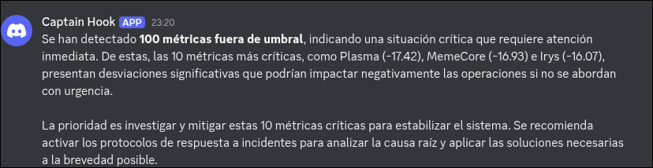

# Prueba Técnica — Desarrollador de Automatizaciones e IA

Sistema de monitoreo de campañas publicitarias que extrae métricas desde una API externa, las evalúa contra umbrales, delega el procesamiento a un flujo de N8N y genera resúmenes ejecutivos con un LLM.

## Stack

- **Node.js + TypeScript** (ejecución con `tsx`)
- **BullMQ + Redis** para jobs recurrentes y colas
- **N8N** para orquestación y notificaciones (Discord, Google Sheets, Slack)
- **OpenRouter SDK** como proveedor LLM
- **Prisma** (parte 3B, code review)

---

## Requisitos previos

Antes de correr el proyecto en local:

1. **Node.js** >= 20
2. **Redis** corriendo en `localhost:6379` (BullMQ lo requiere para las colas). Opción rápida con Docker:
   ```bash
   docker run -d --name redis -p 6379:6379 redis:7
   ```
3. **N8N** corriendo localmente (necesario para testear el script). Opción rápida:
   ```bash
   docker run -d --name n8n -p 5678:5678 n8nio/n8n
   ```
   Luego se importa `n8n/N8N Workflow.json` desde la UI.
4. Una API key gratuita de [OpenRouter](https://openrouter.ai) para el resumen LLM.

## Cómo correrlo localmente

1. Clonar el repositorio.
2. Instalar dependencias:
   ```bash
   npm install
   ```
3. Copiar `.env.example` a `.env` y completar las variables:
   ```bash
   cp .env.example .env
   ```
   Variables relevantes:
   - `API_URL`, `API_KEY` → fuente CoinGecko.
   - `WEBHOOK_URL` → URL del webhook de N8N.
   - `OPENROUTER_API_KEY` → proveedor LLM.
   - `REDIS_HOST`, `REDIS_PORT` → opcionales, por defecto `localhost:6379`.
4. Arrancar el proyecto:
   ```bash
   npm start
   ```

El script realiza una primera ejecución inmediata y queda vivo ejecutando el job recurrente cada 5 minutos. Usar `Ctrl+C` para detener.
---

## Parte 1 — Integración de API y Lógica de Negocio

Script en TypeScript que consume la API pública de **CoinGecko**, transforma el resultado a la estructura `CampaignReport` y aplica umbrales (`ok` / `warning` / `critical`).

### Decisiones técnicas

- **API elegida (CoinGecko):** expone variaciones porcentuales (`price_change_percentage_24h`) que encajan naturalmente con el campo `metric` y permiten simular un flujo real de campañas con umbrales positivos/negativos. Es pública, no requiere OAuth y tiene capa gratuita estable.
- **Patrón Adapter:** la fuente externa no coincide 1:1 con el dominio, así que `coinGeckoAdapter` aísla la traducción `RawData → CampaignReport`. Agregar una nueva fuente implica sólo añadir un nuevo adapter, sin tocar la lógica de negocio.
- **Retry con backoff exponencial:** `apiClient` reintenta hasta 3 veces con delay duplicado en cada intento ante fallos de red o respuestas no-OK.
- **Manejo de errores:** cada servicio propaga fallos críticos (`throw`) para que el worker de BullMQ los capture y aplique su propia política de reintentos; los errores no fatales se loguean sin romper la ejecución.

### Sistema de colas (BullMQ + Redis)

Para cumplir el diferencial de *"evaluación de umbrales como job recurrente con BullMQ"* y evitar bloquear el hilo principal:

1. **`pollingQueue`:** programa un job recurrente cada 5 minutos que invoca a `MetricsService.getCampaignData()`, filtra registros en `warning`/`critical` y, si encuentra anomalías, genera el resumen LLM y delega el envío al webhook de N8N.
2. **`calculationQueue`:** cola secundaria preparada para desacoplar envíos hacia N8N con concurrencia controlada y reintentos (extensible a cargas más pesadas).
3. **Worker (`src/jobs/worker.ts`):** consume `pollingQueue`, centraliza el logueo de cada iteración y relanza errores para que BullMQ reintente automáticamente.

Ventajas: resiliencia ante caídas de red, control de concurrencia y separación clara entre *polling*, *evaluación* y *delivery*.

### Integración con LLM dentro del ciclo

Antes de enviar el payload al webhook de N8N, el worker invoca a `LlmService.generateCampaignSummary()` con las campañas críticas. El resumen ejecutivo viaja **dentro del mismo payload** (`{ reports, llmSummary }`) hacia N8N, cumpliendo el diferencial de *"conectar el resumen del LLM como mensaje adicional del flujo de N8N"*.

---

## Parte 2 — Flujo de N8N

Ver documentación detallada del flujo, bifurcaciones y manejo de errores:

**[n8n/README.md](./n8n/README.md)**

El export JSON está en `n8n/N8N Workflow.json`.

---

## Parte 3 — Code Review y Prisma

Diagnóstico del código recibido, refactor quirúrgico y query Prisma:

**[code_review/README.md](./code_review/README.md)**

---

## Parte 4 — Integración con LLM

Implementada en `src/services/llm.service.ts`.

### Decisiones técnicas

- **Proveedor:** **OpenRouter** (`@openrouter/sdk`). Elegido por su capa gratuita, el modelo por defecto es `google/gemini-2.5-flash` (buen ratio velocidad/costo/calidad para resúmenes cortos) y por exponer un API compatible con el estilo `chat.completions`, lo que facilita migrar a otros proveedores (OpenAI, Anthropic) si se desea.
- **Prompt:** el sistema instruye un rol de *"analista de datos"* y pide un resumen ejecutivo profesional de máximo dos párrafos. El mensaje de usuario incluye el total de anomalías y un top-10 de campañas ordenadas por métrica ascendente (las más críticas primero) para que el modelo priorice contenido relevante sin exceder contexto.
- **Respuesta tipada:** la salida se envuelve en un tipo `LLMSummary` (`generatedAt`, `model`, `summary`, `rawResponse`) — no se usa `any`.
- **Resiliencia:** si no hay `OPENROUTER_API_KEY`, se devuelve un resumen simulado con el mismo tipo (el sistema sigue funcionando en entornos sin credenciales). Cualquier excepción en la llamada al LLM se captura y se devuelve un fallback informativo, evitando romper el pipeline.
- **Flujo integrado:** el resumen se incluye en el payload enviado a N8N, disponible para ser reenviado al canal de Discord/Slack del flujo.



---

## Parte 5 — Diseño conceptual de un Agente

Modelo Re-Act con tool-calling, loop de razonamiento y auditabilidad, incluye diagrama ASCII:

**[DESIGN.md](./DESIGN.md)**

---

## Notas de entrega

- `.env` está en `.gitignore`; `.env.example` documenta todas las variables necesarias.
- El proyecto compila con `tsc --noEmit` (sólo produce un *warning* deprecatorio de `baseUrl` para TS 7.x, no un error).
- La carpeta `code_review/` está excluida del `tsconfig.json` porque depende del cliente de Prisma generado, que sólo se crea bajo demanda con `npx prisma generate`.
