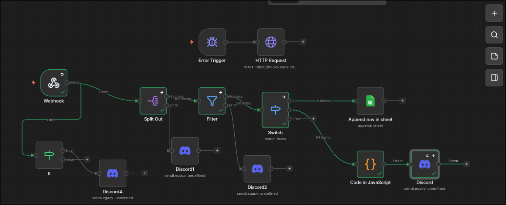
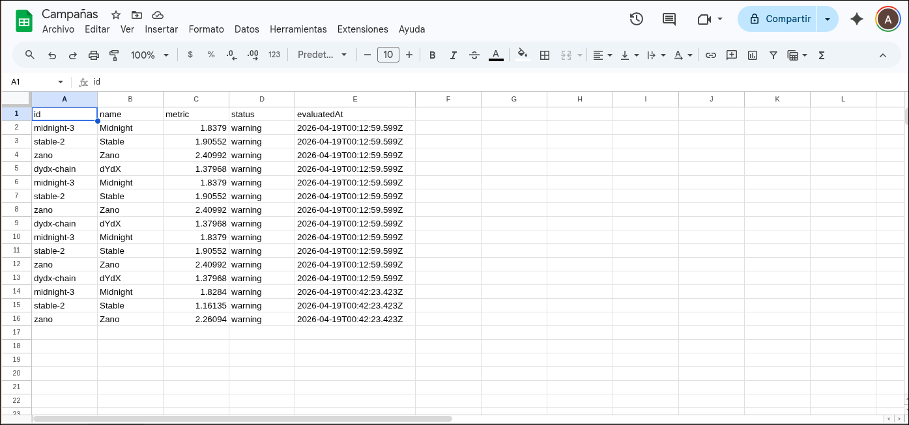
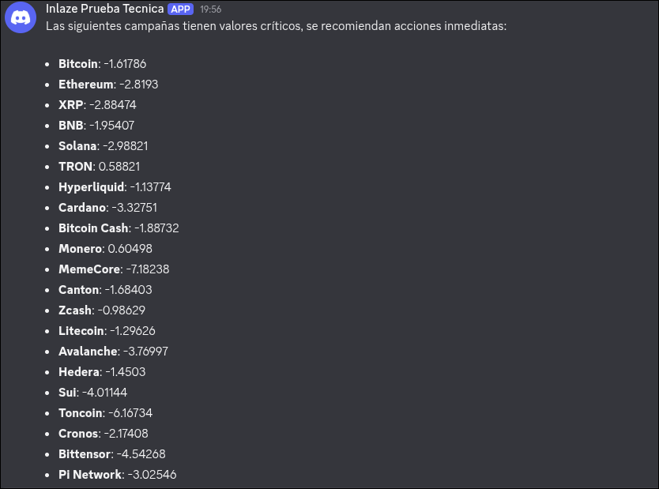

# PARTE 2 - Flujo de Automatización en N8N

En esta sección se detalla el procesamiento en la nube a través de N8N de los datos extraídos en la Parte 1. El flujo está diseñado asegurando alta tolerancia a fallos, bifurcaciones lógicas claras, y cumple con el diferencial de tener una integración completa _end-to-end_ sin interrupciones.

### Arquitectura del Flujo Principal

1. **Webhook (Trigger):** El punto de entrada principal configurado por método POST. Recibe automáticamente el listado de campañas convertido a formato JSON desde el servicio `MetricsService` en TypeScript. Con esto se cumple el diferencial de **"Integración real entre partes"**.
2. **Split Out:** Este nodo "rompe" el gran arreglo de datos (`body.data`) recibido desde la API externa, mapeando cada campaña como un _Ítem independiente_ para favorecer el procesamiento paralelo que ofrece nativamente la máquina de N8N.
3. **Filter:** Filtra el ruido innecesario desechando todos los registros con estatus `'ok'`. Solo sobreviven las iteraciones verdaderamente procesables.
4. **Switch (Bifurcación Crítica):** Un ruteador semántico que bifurca de manera estricta el tráfico restante analizando la variable `status`:
   - **Ruta Warning (Output 0):** Los registros en "warning" son dirigidos hacia el nodo nativo de **Google Sheets** (Append row in sheet), donde se documentan para revisión humana no urgente.
     
   - **Ruta Critical (Output 1):** Los registros en "critical" pasan por un nodo auxiliar **Code (JavaScript)** para dar formato estético a la información y aterrizan en un nodo nativo de **Discord**. Todo el equipo técnico es notificado en cuestión de milisegundos mediante un webhook.
     

### Sistema de Prevención de Caídas y Manejo de Errores

Para satisfacer el requisito de _no romper toda la ejecución_ y tener auditoría confiable, el flujo incluye múltiples capas defensivas:

1. **Enrutamiento por salida de Error (Local):** Los nodos propensos a errores locales de sintaxis en etapas iniciales (como _Split Out_ y _Filter_) tienen conectadas sus salidas nativas de error a notificaciones silenciosas de recuperación por Discord.

2. **Error Trigger Global:** Se integró un manejador de excepciones global que vive flotando en el lienzo. Este nodo "escucha" fallos generalizados de conectividad u otros accidentes.

3. **HTTP Request Webhook (Slack):** Al colapsar algún paso y dispararse el Error Trigger, el flujo loguea instantáneamente los detalles extraídos del `$json.execution.error` y envía una petición HTTP cruda formateada para su consumo en **Slack**, adjuntando la URL de la ejecución, el nombre del nodo fallido y la traza exacta para rápida depuración técnica. La necesidad del uso de HTTP es debido a restricciones de seguridad de parte de Slack a la hora de trabajar con conexiones http.

